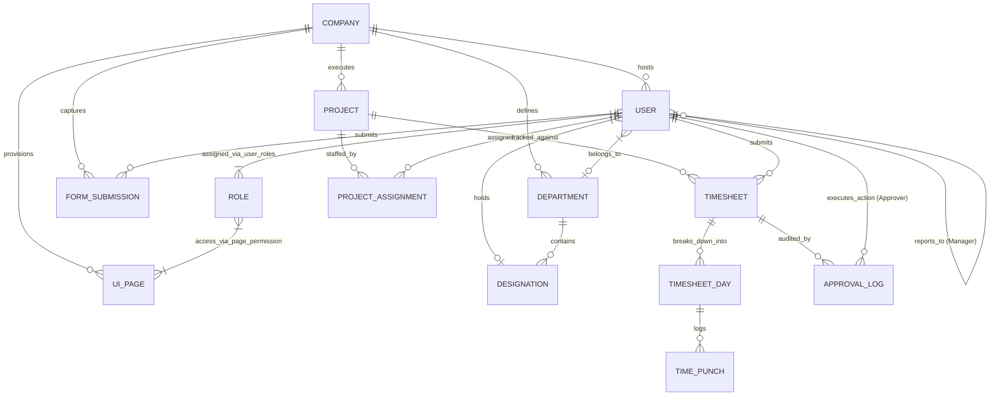

# NexusOS Enterprise HRMS - Technical Manual

## Table of Contents
1. [Initial Provisioning & Identity](#chapter-1)
2. [Communication Infrastructure](#chapter-2)
3. [Team Governance & Resource Allocation](#chapter-3)
4. [Structural Architecture & Live Network](#chapter-4)
5. [Operational Performance Monitoring](#chapter-5)
6. [Advanced Intelligence & Elite Builder](#chapter-6)
7. [System Health & Final Status](#chapter-7)

---

## Chapter 1: Initial Provisioning & Identity

### 1.1 Secure Authentication
The NexusOS ecosystem begins with a high-fidelity authentication gate. This interface supports multi-tenant login, allowing users to enter via corporate credentials or unified Google OAuth.

### 1.2 Security Hardening
For accounts registered via third-party OAuth providers, NexusOS enforces an immediate security hardening protocol. Users must establish a "Backup Password" to ensure account recovery and maximum enterprise security.

### 1.3 Tenant Identification
The organization data module establishes the foundational identity of the workspace. This includes corporate addressing and contact information which is used across the system's reporting engines.

### 1.4 Identity Engine (Theming)
NexusOS utilizes a dynamic Identity Engine that allows administrators to define foundational CSS variables (Primary Accent, Base Background, Light Accent, Bold Text). These variables brand the entire workspace dashboard UI in real-time.

### 1.5 Visual Asset Management
Administrators can finalize their tenant identity by uploading corporate logos. The system recommends transparent SVG/PNG assets for seamless integration into the UI.

---

## Chapter 2: Communication Infrastructure

### 2.1 Administration Setup Summary
Once the core identity is established, the system provides a summary of the administration setup, indicating that the tenant is ready for infrastructure provisioning.

### 2.2 SMTP Protocol Establishment
A critical prerequisite for team collaboration is the Mail Configuration. Before invitations can be sent, administrators must securely establish SMTP parameters (Host, Port, Sender Address, Auth Username, and App Password).

### 2.3 Provisioning Verification
Upon successful configuration, the system provides immediate feedback. A verified mail server is the backbone of the "Invite Personnel" workflow.

---

## Chapter 3: Team Governance & Resource Allocation

### 3.1 Corporate Nexus Dashboard (Overview)
The main dashboard serves as the **Operational Intelligence Framework**. Note that while the dashboard provides a real-time feel, many high-level metrics (Total Workforce: 1,248, Operational Health: 98.2%) are currently rendered with **Optimized Static Data** to serve as industry benchmarks during initial deployment.

> [!NOTE]
> The **Personnel Growth Dynamics** chart and **Structural Resource Matrix** provide visual projections of organizational health based on these benchmarks.

### 3.2 Invite Personnel Workflow
The most critical administrative action on the dashboard is the "Invite Personnel" feature. This module handles the secure deployment of new team members into the system.

#### Step-by-Step Invitation:
1. **Targeting**: Enter the recipient's corporate email and full name.
2. **Role Mapping**: Assign a role (Standard Employee, Manager, Admin).
3. **Departmental Association**: Map the user to a specific department and designation.
4. **Token Generation**: The system formulates a unique, secure invitation token.

### 3.3 Secure Link Formulation
Once the invitation is formulated, a secure access string is generated. This link allows the recipient to bypass standard registration and associate seamlessly with the organization profile.

### 3.4 Email Orchestration
The system automatically delivers the invitation link to the recipient's inbox using the previously configured SMTP server.

### 3.5 Recipient Onboarding
Recipients receive a professional invitation and are guided through a tailored onboarding flow, including password establishment and profile completion.

---

## Chapter 4: Structural Architecture & Live Network

### 4.1 Personnel Matrix Flow
The Live Network module provides a revolutionary way to visualize organizational hierarchy. This interactive Personnel Matrix allows for structural governance at scale.

### 4.2 Hierarchical Visualization
Administrators can zoom and pan through the organizational matrix, viewing node details for every team member and their reporting lines.

### 4.3 Structural Governance
The system allows for real-time adjustments to the organizational hierarchy, ensuring that the structural matrix remains aligned with corporate evolution.

---

## Chapter 5: Operational Performance Monitoring

### 5.1 Attendance Protocol Console
The Attendance module enforces a strict protocol for time tracking. The console allows employees to execute "Punch In" and "Punch Out" actions, maintaining a real-time log of their operational status.

### 5.2 Daily Status & Tracking
Employees can provide daily status updates and track their history across the organization. This data feeds into the larger performance index.

### 5.3 Timesheet Control Console
The Timesheet module provides a strategic console for resource auditing. It tracks total effort, daily utilization, and active nodes across all projects.

### 5.4 Authorization Queue (Governance)
Managers utilize the Authorization Queue to audit and approve mission-critical effort reports. This ensures that every hour captured is verified against project milestones.

---

## Chapter 6: Advanced Intelligence & Elite Builder

### 6.1 Elite Builder: Architect Mode
The Elite Builder is the system's "Low-Code" heart. In Architect mode, developers can engineer complex UI components and data flows without writing manual code.

### 6.2 Component Toolbox & Engineering
The builder provides a rich toolbox of enterprise components (Gauges, Data Grids, Logic Gates) that can be dragged into the workspace for rapid prototyping.

### 6.3 Real-time Form Analysis
Monitor the real-time flow of administrative data. The Form Analysis engine provides deep visibility into how data is being captured and processed across the protocol layer.

### 6.4 UI MetaData & Styling Protocol
Administrators can configure granular UI MetaData, including layout strategies, styling protocols, and data binding rules, ensuring a consistent and premium user experience.

### 6.5 Deployment & Synchronization
Once a component is engineered, it can be deployed across the organization with built-in sync intelligence to ensure data consistency across all endpoints.

---

## Chapter 7: System Health & Final Status

### 7.1 Enterprise Performance Summary
The manual concludes with a final overview of the system's performance. The final dashboard views show a healthy, fully provisioned enterprise ecosystem.

### 7.2 Post-Deployment Audit
The final session audit confirms that all protocol layers are operating efficiently and the system is ready for full-scale operational deployment.

---

## Chapter 8: Database Architecture & ER Diagram

### 8.1 Technical Schema Overview
NexusOS is architected on a high-fidelity relational schema optimized for multi-tenant SaaS operations. The database ensures strict data isolation between tenants (Companies) while facilitating complex cross-module governance.

### 8.2 Entity-Relationship (ER) Diagram
The following diagram illustrates the core structural relationships between identity, governance, and operational layers.

### 8.3 Core Data Clusters
- **Identity Core**: Centered around `Company` and `User` for secure authentication and theming.
- **Organizational Matrix**: Composed of `Department` and `Designation` for structural hierarchy.
- **Operational Logic**: Managed via `Project`, `Timesheet`, and `TimePunch` for precision resource auditing.
- **Governance Layer**: Enforced by the `ApprovalLog` and `manager_id` self-referential links.

---

**Manual End**
*Copyright © 2026 NexusOS Enterprise. All Rights Reserved.*
